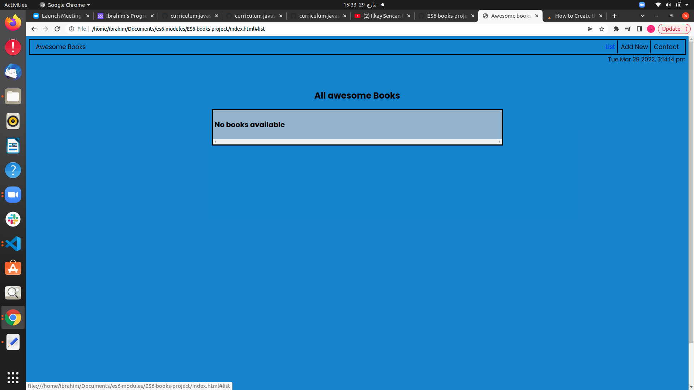

# Awesome books: with ES6

"Awesome books" is a simple website that displays a list of books and allows you to add and remove books from that list. see how to manage data using JavaScript. built with medium-fidelity wireframe for UI.

## Built With

- HTML
- CSS
- Javascript
- HTML&CSS Linter
- Git

[LIVE DEMO LINK]( https://ibrahim777764.github.io/ES6-books-project/)

#

## Authors

👤 **Author1**

- GitHub: [@https://github.com/ibrahim777764](https://https://github.com/ibrahim777764)

# Get Started

Please get your browser update.
To get a local copy up and running follow these simple steps.

Run the command below from the Terminal:

      git clone <URL> in your terminal

      cd awesome-books

      start index.html
## 🤝 Contributing

Contributions, issues, and feature requests are welcome!

## Show your support

Give a ⭐️ if you like this project!

## Acknowledgments

Microverse Community

## 📝 License

This project is [MIT](LICENSE) licensed.
